# Projeto de Análise de Emendas Parlamentares (ETL no Databricks)

Este projeto tem como objetivo processar e analisar dados de **Emendas Parlamentares** através de um pipeline de ETL moderno na plataforma Databricks. A solução utiliza a **Arquitetura Medalhão (Medallion Architecture)** com Unity Catalog para estruturar os dados e o **Databricks Genie** para a criação de painéis e consultas em linguagem natural.

## 🎯 Objetivo

Construir um fluxo de ingestão, transformação e agregação (ETL) dos dados de Emendas Parlamentares. Os dados brutos são recebidos em formato CSV, refinados ao longo de camadas estruturadas em formato Delta (Bronze, Silver e Gold) utilizando o Unity Catalog, e finalmente disponibilizados na camada Gold. A camada Gold servirá como base de conhecimento estruturada para o **Databricks Genie**, onde usuários finais poderão gerar dashboards e fazer perguntas de negócio utilizando linguagem natural.

## 🏗️ Arquitetura de Dados (Medalhão)

```mermaid
flowchart LR
    subgraph Raw ["Landing Zone (Volumes)"]
        CSV["Arquivos CSV Brutos<br/>(ISO-8859-1 / UTF-8)"]
    end

    subgraph Bronze ["Camada Bronze (Delta)"]
        B1["bronze_emendas_parlamentares"]
        B2["bronze_emendas_convenios"]
        B3["bronze_emendas_favorecidos"]
    end

    subgraph Silver ["Camada Silver (Delta)"]
        S1["silver_emendas_limpas"]
        S2["silver_convenios_favorecidos"]
    end

    subgraph Gold ["Camada Gold (Delta)"]
        G1["gold_metricas_emendas"]
    end

    subgraph Consumption ["Consumo & BI"]
        Genie["Databricks Genie / Dashboards"]
    end

    CSV --> Bronze
    Bronze --> Silver
    Silver --> Gold
    Gold --> Genie
```



- **Raw (Volumes do Unity Catalog):** Área de pouso (*Landing Zone*) onde os arquivos originais (`.csv`) são ingeridos e armazenados sem nenhuma modificação.
- **Camada Bronze:** Ingestão dos dados brutos do Volume para Tabelas Delta. Os nomes de colunas são sanitizados para o padrão `snake_case` e os dados mantêm a granularidade de origem (as-is), ganhando performance e versionamento.
- **Camada Silver:** Limpeza, padronização de tipos de dados, tratamentos de nulos, deduplicação e cruzamento (*join*) de informações (ex: Emendas com Convênios e Favorecidos).
- **Camada Gold:** Dados agregados e modelados para o negócio, prontos para consumo por ferramentas de BI e pelo **Databricks Genie** para relatórios gerenciais e análises interativas.

## ⚙️ Stack Tecnológica

- **Linguagem:** Python 3.10+ (PySpark, Databricks SDK)
- **Plataforma de Dados:** Databricks (Databricks Asset Bundles - DABs, Delta Live Tables)
- **Governança e Armazenamento:** Unity Catalog (Volumes e Delta Lake)
- **Qualidade & Testes:** `pytest`, `chispa`
- **Visualização e BI:** Databricks Genie

## 📂 Estrutura do Projeto

```
projeto/
├── databricks.yml                      # Configuração do Databricks Asset Bundle (DAB)
├── pyproject.toml                      # Dependências, empacotamento e configuração do pytest
├── notebooks/
│   ├── projeto_inicial.ipynb           # Notebook de provisionamento (catálogo, schemas, volume)
│   └── sample_notebook.ipynb           # Notebook interativo de validação
├── src/
│   ├── etl_emendas_parlamentares/      # Pacote Python principal
│   │   ├── __init__.py
│   │   ├── main.py                     # Entrypoint do job Databricks
│   │   └── emendas.py                  # Leitura de CSVs do Volume e sanitização de colunas
│   └── etl_emendas_parlamentares_etl/  # Pipeline Lakeflow / DLT
│       ├── README.md
│       ├── explorations/               # Análises exploratórias
│       └── transformations/            # Definições de tabelas DLT (Bronze → Silver → Gold)
│           └── bronze_emendas.py       # Tabelas Bronze Delta Live Tables
├── resources/                          # Definições YAML de jobs e pipelines do bundle
├── tests/                              # Testes unitários locais automatizados
│   ├── conftest.py                     # Fixture de SparkSession local para testes
│   └── emendas_test.py                 # Testes de sanitização e lógica de leitura
├── database/                           # CSVs originais baixados localmente (ignorado no git)
└── .gitignore                          # Arquivos e credenciais ignorados
```

## 🚀 Como Executar

### 1. Pré-requisitos e Ambiente Local

1. Crie e ative o ambiente virtual Python:
   ```bash
   python -m venv .venv
   .venv\Scripts\activate   # No Windows
   # source .venv/bin/activate  # No Linux/macOS
   ```
2. Instale as dependências:
   ```bash
   pip install -e .
   pip install pytest chispa
   ```
3. Execute os testes unitários locais:
   ```bash
   pytest
   ```

### 2. Configuração do Databricks CLI

Configure o perfil de autenticação:
```bash
databricks configure --profile DATALAKE_EXs
```

### 3. Provisionamento e Deploy

1. Execute o notebook `notebooks/projeto_inicial.ipynb` para criar o catálogo (`datalake_emendas`), schemas (`bronze`, `silver`, `gold`) e volume (`raw`).
2. Faça o upload dos arquivos CSV para o volume `/Volumes/datalake_emendas/bronze/raw/`.
3. Valide o bundle:
   ```bash
   databricks bundle validate --profile DATALAKE_EXs
   ```
4. Realize o deploy para o workspace do Databricks:
   ```bash
   databricks bundle deploy --profile DATALAKE_EXs
   ```
5. Execute a pipeline ou o job:
   ```bash
   databricks bundle run etl_emendas_parlamentares_etl --profile DATALAKE_EXs
   ```

